#Arduino-Eclipse-Plugin

The Arduino Eclipse Plugin/IDE.

The Eclipse IDE (Integrated Developement Environment) is a full featured programming editor with many fantastic features to help you code more quickly and easily. The Arduino IDE is great for what it does – but it doesn't do much to help writing, navigating and understanding your (and other people's) code.

The Arduino Eclipse Plugin bridges that gap and helps move you to a more powerful development environment whilst keeping the Arduino hardware and libraries that you love (and make life simple).

It works on MS Windows, Mac OSX and Linux.

## What if I am not a developer?

If you are not a developer and don't want to build from sources, then there are precompiled product packages and update sites available. See the details at http://www.baeyens.it/eclipse/.

## Quick Installation 
### Prerequisites

Please install [git] (http://git-scm.com/downloads) and [maven] (http://maven.apache.org/download.cgi).

### Build from source

```bash
git clone https://github.com/jantje/arduino-eclipse-plugin
cd arduino-eclipse-plugin
mvn verify
```

Then the runnable application executable can be started, i.e. on a 64-bit mac, with:

```bash
open it.baeyens.arduino.product/target/products/it.baeyens.arduino.product/macosx/cocoa/x86_64/eclipseArduino/eclipseArduinoIDE.app
```

On Linux you can run start eclipse using provided shell script:

```bash
./build_then_launch_plugin.sh
```

### Running the IDE/Plugin

Windows

 * win32x64.cmd (if you are on 64 bits windows)
 * win32x32.cmd (if you are on 32 bits windows)
 
Mac OSX and Linux
 
 * ./build_then_launch_plugin.sh

=======

## Build Options

You can control the maven build with the following profiles:

* luna (builds agains the luna repositories (4.4))
* mars (builds agains the mars repositories (4.5))
* win32 (builds for 32 bit windows)
* win64 
* linux32
* linux64
* mac32
* mac64

##### Examples:

```bash
mvn verify -Plinux32 (builds for luna and linux 32 bits)
mvn verify -Pwin32,mars,linux32
```

To build for luna and the platform you are running on:

```bash
mvn verify 
```

### Setting up a repository

If you want to import the latest code based plugin to another Eclipse setup you have then it is possible to setup a local repository to install the plugin you have just built. Just add a local repository with location ```arduino-eclipse-plugin/it.baeyens.arduino.product/target/repository```

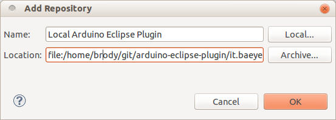

## Developing (Improving) the Plugin

 * Fork the repository on GitHub (https://help.github.com/articles/fork-a-repo) for your changes. Note that your git link should look like this: https://github.com/YOUR_FORK/arduino-eclipse-plugin.git –– we will use it later.
 * Checkout locally
 * Make changes
 * Run ```mvn verify``` to build 
 * Open the self-contained IDE and verify
 * (Anything special about Travis CI & builds?)

You should already have a supported Eclipse version installed (the CDT package makes a good start point). Let's add:

#### Adding Eclipse PDE (Plugin Development Environment)

> Help → Install New Software → Work with: → All Available Sites

Now search/select the *Eclipse Plug-in Development Environment*

Note: This may take a while to download all the available packages.

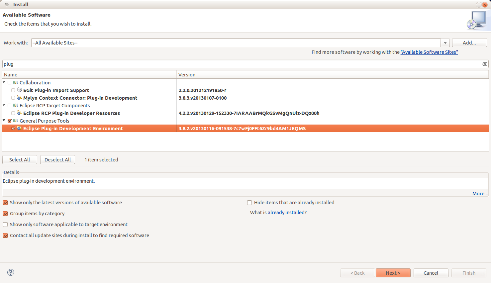


#### Adding Eclipse JDT (Java Development Tools)

If you're not using Eclipse with the JDT you'll need to install them. To do this you first need to open the Dialog for installing new Software:

> Help → Install New Software

There you select for *Work with:*  *YOUR_ECLIPSE_RELEASE - http://download.eclipse.org/releases/YOUR_ECLIPSE_RELEASE*

After that, select
 
> Programming Languages → Eclipse Java Development Tools

#### Add EGit - Eclipse Git Team Provider

To install EGit you'll need to do the following:

> Help → Install New Software

There have to enter the following URL and press ENTER.

 * http://download.eclipse.org/egit/updates

Now you have to open up the *Eclipse Git Team Provider* Category and select *Eclipse Git Team Provider*. 
Then press next and follow the instructions.

### Importing an Arduino Plugin Project into Eclipse

After you installed all the plugins you'll need to restart Eclipse.

Eventually your plugin source code will be ready to be used with Eclipse. There are two ways to import your projects into Eclipse:

#### 1. Via a Command Line

If you're using Windows you should first install [GitHub for Windows](http://windows.github.com/).

First you should open a command line, and change the directory to the directory where you want to store your Project.

Now you have to clone your Fork:

```bash
git clone https://github.com/YOUR_FORK/arduino-eclipse-plugin.git
```

After that you should import the Project to Eclipse:

> File → Import → Plug-in Development → Plug-ins and Fragments

You should select all as shown in this picture.

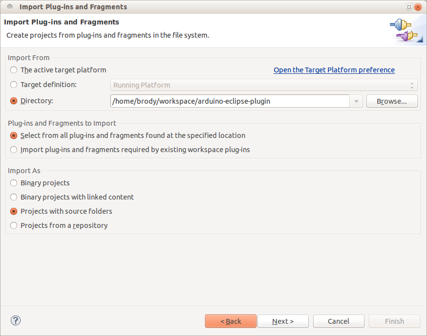

You may need to change the directory to match the directory where you cloned the project into.

Press Next.

In the next window you have to select which Plug-in fragments you want to import.
Select all that are appropriate:

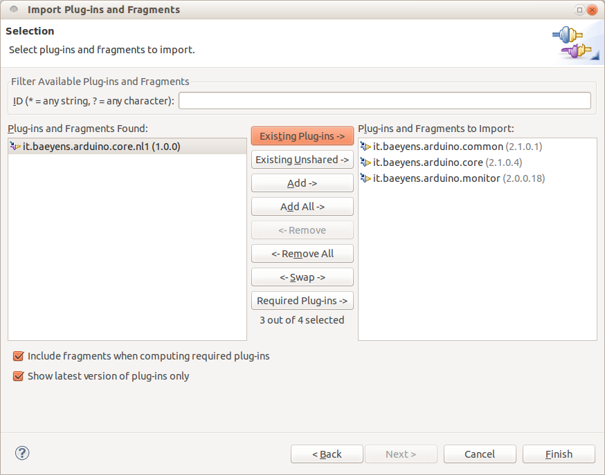

Now press Finish, and it should import the selected Projects.


#### 2. Via EGit interface.

> File → Import → Git → Projects from Git → Clone URI

* Now type your fork in to URI, for example: ```https://github.com/YOUR_FORK/arduino-eclipse-plugin.git```
* Press "Next".
* Branch Selection: master
* Local destination: ```/home/your_name/git/arduino-eclipse-plugin``` or ```c:\git\arduino-eclipse-plugin```
* The rest of page unchanged.
* Next
* Select a wizard: Import Existing Projects
* Next
* Import Projects
* Select all the projects
* Finish

After all it should look like this:
 
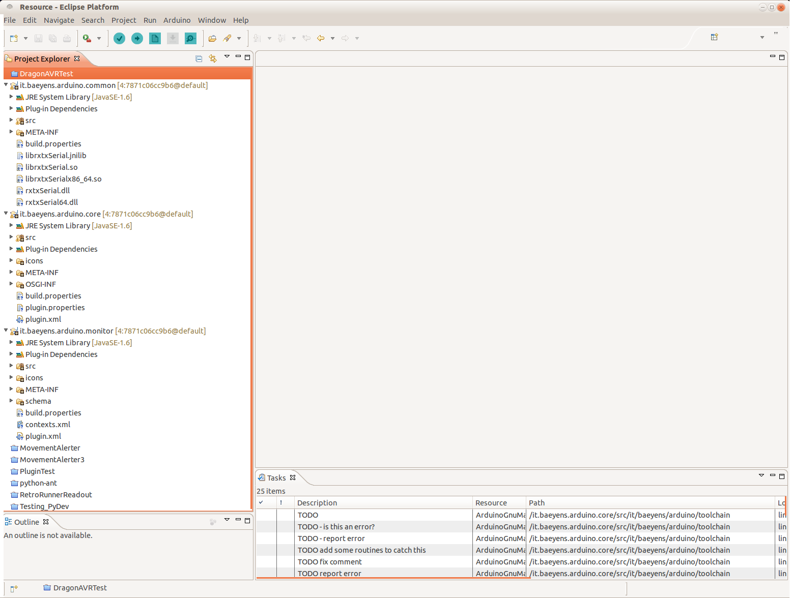

### Set the Code Formatting

To avoid having changes all the time because of different formatting this project contains a formatting xml.

Go to 

> Window → Preferences → Java → Code Style → Formatter 

and import ```codeformat.xml``` from the root of the repo.

### Set the Warning Level

We want to keep the chance of missing a problem in the code to a minimum and to keep clean and tidy code. Development is 
aiming to keep compiler warnings to a minimum (items that show up in the Problems tab under Warnings) with specific settings. 
Please change your settings from default as follows:

Go to 

> Window → Preferences → Java → Compiler → Errors/Warnings
 
and change the following from their defaults.

My current settings are as follows:

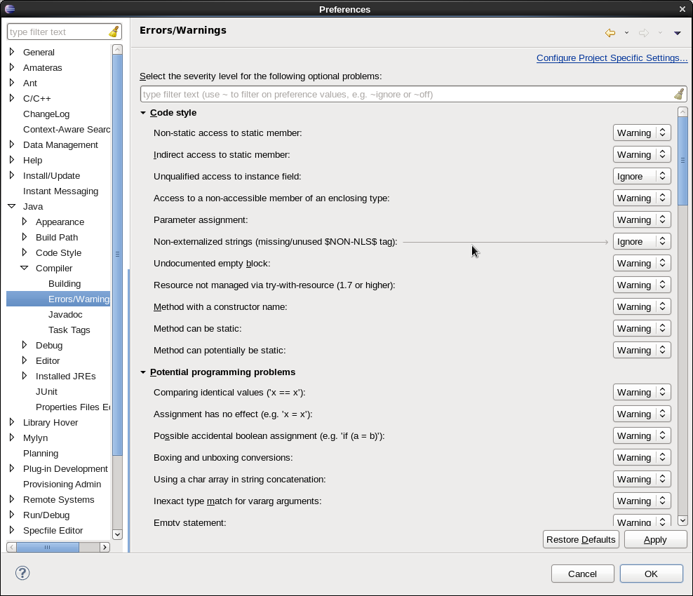
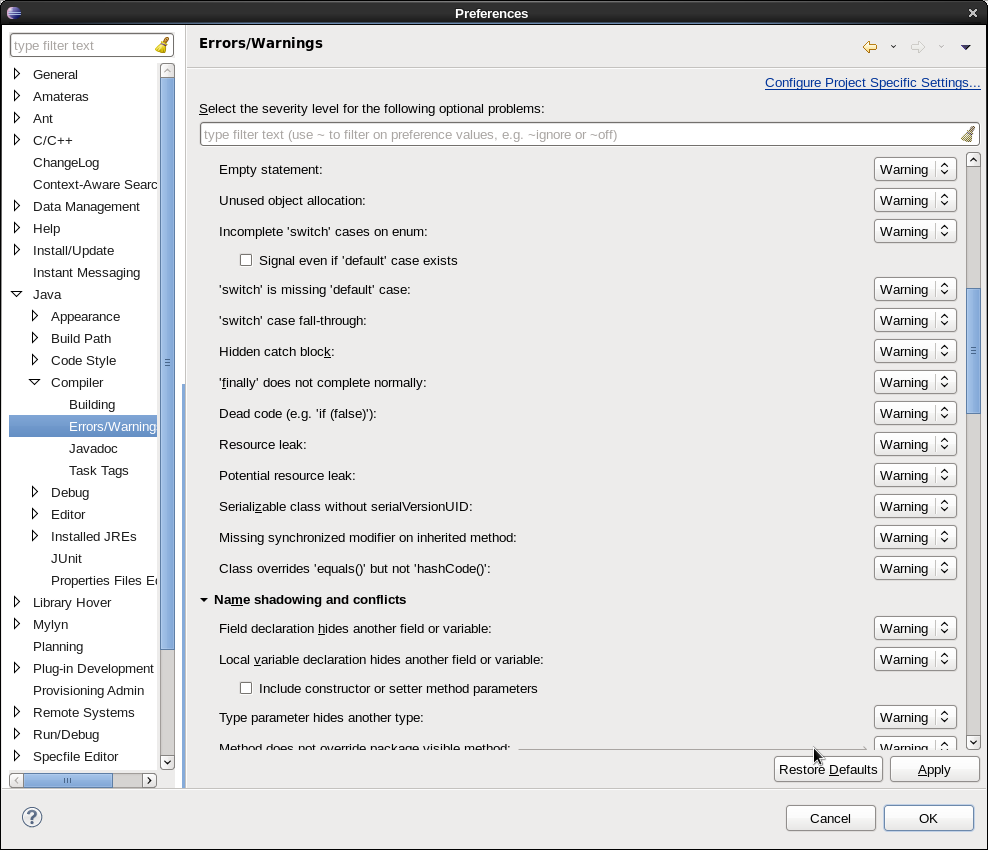
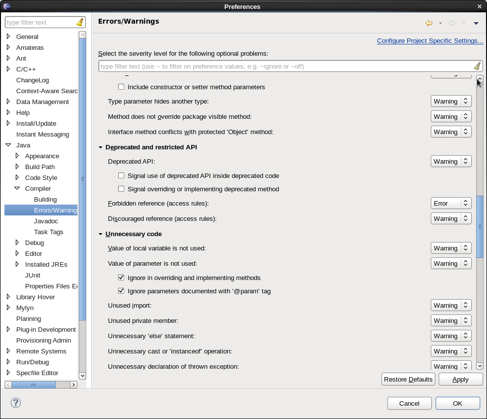
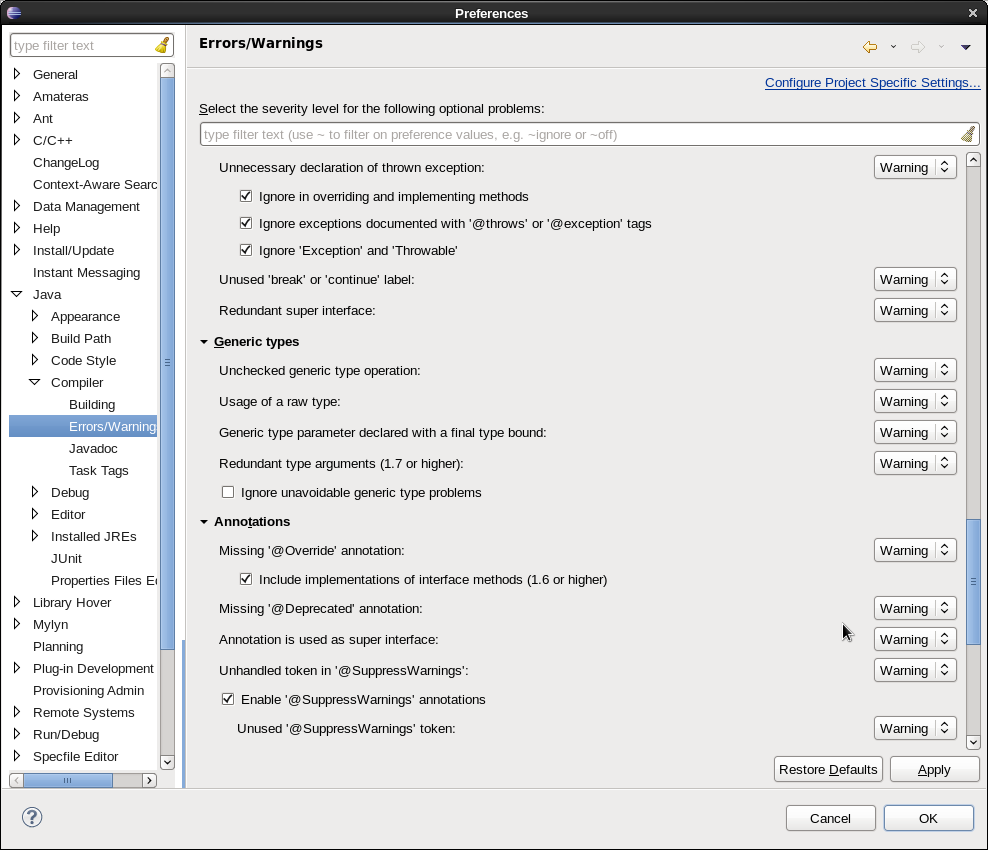
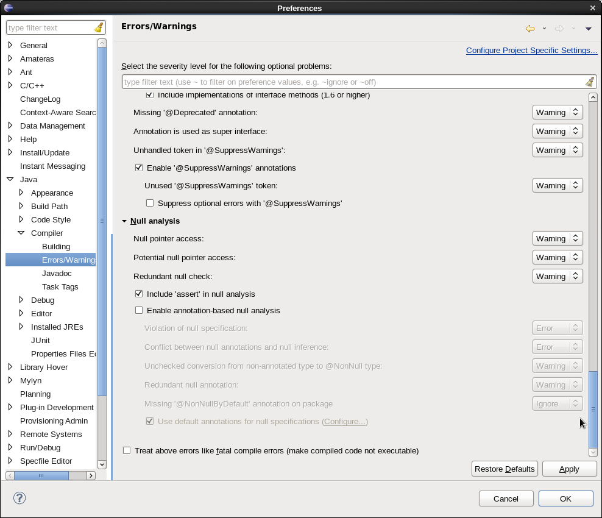

 * Name shadowing and conflicts. Set all to Warning.
 * Unnecessary code. Set all to Warning.
 * Null analysis. Set all active (not greyed out) to Warning.
 * Potential programming problems. Set all to Warning.

### Running the Plugin

Then running is very simple - just right click it.bayaens.arduino.core and select:

> Run as → Eclipse Application

OR, if you'd like to debug,
 
> Debug as → Eclipse Application

Eclipse will launch a new workbench disabling the installed version if any, and updating it with the plugin version loaded in the current workspace.

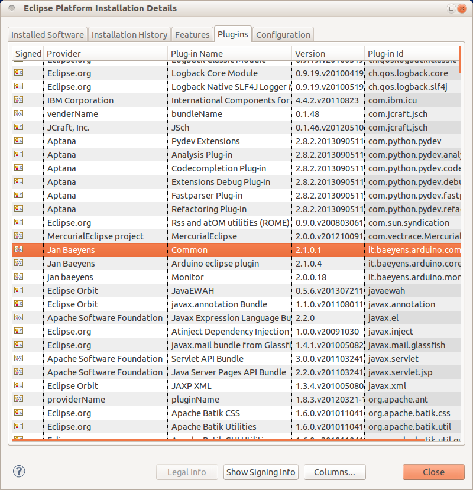

Now, just set up fresh again with your project settings, Preferences/Arduino, to point to IDE and private libs.

> New Project → Arduino → New Arduino Sketch

All should work. You can set breakpoints in the launching Eclipse if you ran as debug. Happy developing!

[](http://with-eclipse.github.io/) 
