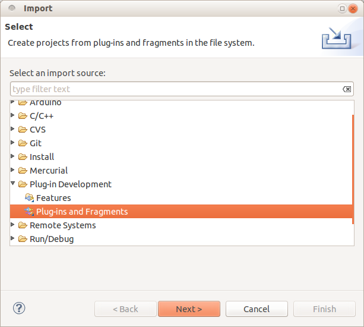

#Arduino-Eclipse-Plugin

Add stuff here on normal usage

##Developing (Improving) the Plugin

Fork the repository on GitHub.
Your link should look like this: https://github.com/YOUR_FORK/arduino-eclipse-plugin.git

###Add Eclipse Plugin Development Environment into your Eclipse Environment

Help-> Install New Software -> Work with: -> All Available Sites

Now select the *Eclipse Plug-in Development Environment*

###Recommended plugins

For completeness you should install (if not already installed)

####The Java Development Tools

If you're not using Eclipse with the JDT you'll need to install them. To do this you first need to open the Dialog for installing new Software:

*Help*-> *Install New Software*

There you select for *Work with:*  *YOUR_ECLIPSE_RELEASE - http://download.eclipse.org/releases/YOUR_ECLIPSE_RELEASE*

There you open:
*Programming Languages -> Eclipse Java Development Tools.*

####EGit - Eclipse Git Team Provider

To install EGit you'll need to do the following:

*Help*-> *Install New Software*

There have to enter the following URL and press ENTER.

 *http://download.eclipse.org/egit/updates*

Now you have to open up the **Eclipse Git Team Provider** Categorry and select **Eclipse Git Team Provider** , now you just have to press next and do what the dialog tells you to do.

###Importing the Project

After you installed all the plugins you'll need to restart Eclipse to use them.

You will need to import the projects into Eclipse, there are two ways to do that:

####Via command line

If youre using Windows you should first install [GitHub for Windows](http://windows.github.com/).

First you should open a command line, and change the directory to the directory where you want to store your Project.

Now you have to clone your Fork:

*git clone https://github.com/YOUR_FORK/arduino-eclipse-plugin.git*

After that you should import the Project to Eclipse:

*File -> Import -> Plug-in Development -> Plug-ins and Fragments*

You should select all as shown in this picture.

Of cource you should change the directory to the directory where you cloned the project to.

Press Next.

In the next window you have to select which Plug-in fragments you want to import.
You will select the following:

Now press Finish, and it should import the selected Projects.

<!-- 
 via EGit interface.

*File -> Import -> Git -> Projects from Git -> Clone URI*

Now type your fork in to URI, for example:

*https://github.com/YOUR_FORK/arduino-eclipse-plugin.git*

import, select, plugins, Import Plug-ins and Fragments

Import Plug-ins and Fragments

URI

https://github.com/YOUR_FORK/arduino-eclipse-plugin.git

master

import all existing projects

FINISH
-->

After all it should look like this: 

###Set the formatting
To avoid having changes all the time because of different formatting this project contains a formatting xml.
Go to window->preferences->java->Code style->Formatter import codeformat.xml in the root of the repo.

###Running the plugin

Then running is very simple - just right click it.bayaens.arduino.core and select *run as -> Eclipse Application* (or *debug as -> Eclipse Application* -- letting you set breakpoints)

Eclipse will launch a new workbench disabling the installed version if any of the plugin and updating with the plugins in the current workspace.

images_plugin_dev_setup/running_check_versions.png

Now, just set up fresh again with your project settings:
Preferences/Arduino to point to IDE and private libs

New Project, Arduino, New Arduino Sketch

