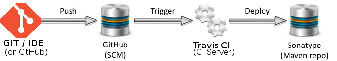

#Travis Continuous Integration and Nexus Sonatype Deployment

##Travis Continuous Integration
This project uses the free-to-OSS Travis CI to test commits.

This allows us to test commits to the master branch and pull requests to see any issues.

The CI overall looks very much like: 

Github integrates well with Travis CI and at many points there are links/images that are travis CI indications that a build was successful (or not).

There are two kinds of Travis CI builds performed:
 * If it is a pull request, then we do a mvn verify
 * If it is a commit on the master (i.e. a merged pull request or any direct commit by Jantje), then we do a mvn deploy

###Verify Pull Requests
Maven verify does a build (but does not send outputs out of Travis). It checks the build excutes and packaging succeeds (It does not deploy because it is not secure to make the secure travis tokens required available to a pull request). A status code will fail if there are issues.

###Deploy commit (on master)
Maven deploy builds and then uploads the outputs to the Sonatype Nexus staging platform.  A status code will fail if there are issues.

_This means that after every change on the master branch we will have a built set of targets that can be tested._

The deploy staging (currently) goes to brodykenrick's Nexus OSS account.

Deployment produces two things:
1) Support for installing the plugin into an existing Eclipse -- An "update site" of the releases and snapshots
2) Support for downloading the total package (Eclipse + plugin + perspective etc) -- Just links to Binaries

The artifacts can be seen at http://oss.sonatype.org/content/repositories/snapshots/com/github/brodykenrick/arduino-eclipse-plugin/

####Deploy "Product"s
The snapshot all-in-one product packages go to : http://oss.sonatype.org/content/repositories/snapshots/com/github/brodykenrick/arduino-eclipse-plugin/it.baeyens.arduino.product (for example http://oss.sonatype.org/content/repositories/snapshots/com/github/brodykenrick/arduino-eclipse-plugin/it.baeyens.arduino.product/1.0.0-SNAPSHOT/)

####Deploy "Update Site"
The snapshot update site goes to : http://oss.sonatype.org/content/repositories/snapshots/com/github/brodykenrick/arduino-eclipse-plugin/it.baeyens.arduino.updatesite/ (for example http://oss.sonatype.org/content/repositories/snapshots/com/github/brodykenrick/arduino-eclipse-plugin/it.baeyens.arduino.updatesite/1.0.0-SNAPSHOT/)

####Deployment Data lifecycle
TBD: We need to understand the duration of data being held at the Nexus repo for these snapshots.

###Travis CI Configuration

See .travis.yml for the details of how this is implemented.

This uses a Travis CI account jantje has linked to his github user name and authorised with a private token. It is automatically triggered on specific commits that github reports to Travis CI about.

Jantje's Travis CI is at: https://travis-ci.org/jantje/arduino-eclipse-plugin

##Nexus Sonatype Deployment

For deployment we use a free-to-OSS Nexus setup from Sonatype -- https://oss.sonatype.org/

Deployment is taken care of by tycho/maven after some configuration in the POM.xml files. Essentially pointing a few key variables to the appropriate Nexus repository details and executing _'mvn deploy'_.

###Nexus Sonatype OSS Configuration

Currently the setup uses the Nexus account created by brodykenrick. Later we will likely move to one controlled by jantje for consistency.

The Nexus repo (groupId) is hardcoded for the project as com.github.brodykenrick.arduino-eclipse-plugin in the POM.XML. The groupid is hardcoded many places (in all the POM.xml) files as using a varaible produces warnings.

See settings.xml for the enviroment variables used in the deployment (and release) process.

They are (check settings.xml in case these docs aren't up to date):
 * CI_NEXUS_USERNAME -- The sonatype OSS account for the Nexus repo (currently for brodykenrick)
 * CI_NEXUS_OAUTH2_TOKEN
 * CI_GPG_PASSPHRASE -- The output artifacts are signed with GPG (currently for brodykenrick)
 * CI_GITHUB_REPOUSERNAME -- This is the github account used for updating the source when doing a release (i.e. jantje)

See .travis.yml for the setting of these environment variables in Travis CI -- usernames and passes and tokens used (many of which are "travis" encrypted against the github repository).

Note - This was setup following loosely:
 * http://blog.sonatype.com/2009/09/maven-tips-and-tricks-using-github/#.Uq5AGfiE3LY
 * http://datumedge.blogspot.com.au/2012/05/publishing-from-github-to-maven-central.html

###Nexus Sonatype Deployment for a Release

TBD - Should be as simple as:

    mvn release:prepare
